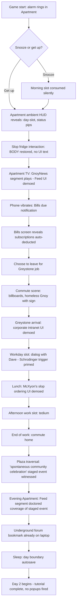
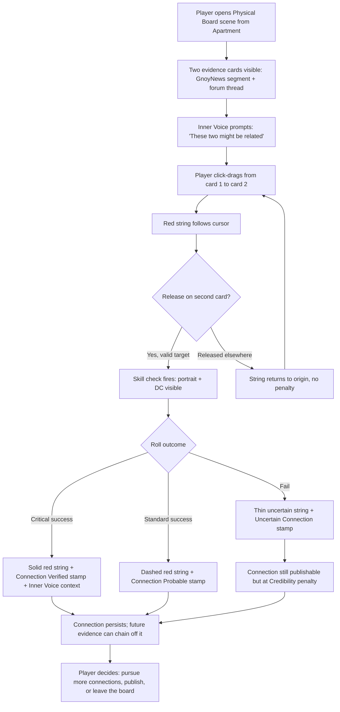
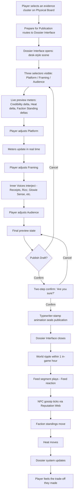
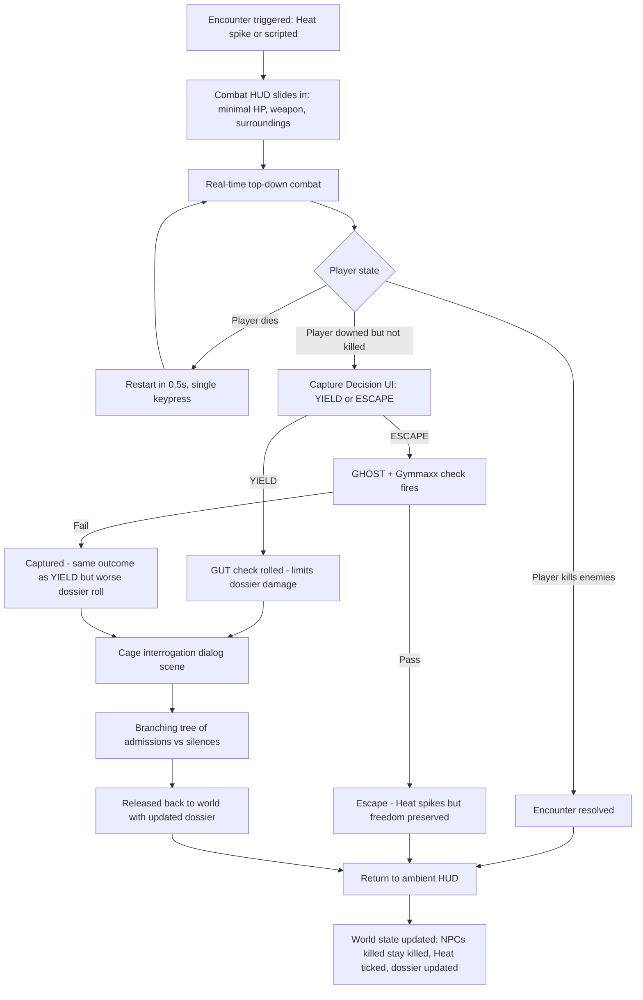
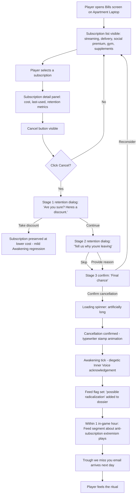

# UX Design Specification — Gnoy Simulator

**Author:** Cpain
**Date:** 2026-05-03

---

## Executive Summary

### Project Vision

Gnoy Simulator is a satirical top-down 2D RPG where the user interface is itself a piece of the satire. The game ships with two parallel UI personalities — a polished Xyoner corporate-app aesthetic and a hand-made Resistance aesthetic — used in the same play session and inverted as the player awakens. Three gameplay layers (Investigation × Simulator × Action) share a single HUD, three custom Investigation panels, a visible-DC-hidden-consequence dialogue system with a 24-voice text-only internal chorus, and a publication interface where the central design pillar (the Truth Paradox) is operationalized. The UX target is "Disco Elysium-tier dialogue depth × Persona-grade day cycle × Hotline-Miami combat snap × Obra-Dinn evidence rigor" delivered through interfaces that read as character, not chrome.

### Target Players

- **Primary — CRPG-investigation crowd (Disco Elysium / Obra Dinn / Pentiment / Citizen Sleeper, ages ~22–40):** Reading-tolerant, build-craft-fluent, save-scum-resistant. Wants dense text, visible DCs, and weaponized conversation logs. Mouse-and-keyboard native.
- **Secondary — action crowd (Hotline Miami / Katana Zero):** Twitch-reflex players drawn in by the combat layer. Need ultra-lethal, instant-restart combat UX with minimal friction at the encounter boundary.
- **Secondary — sim-rhythm crowd (Stardew / Persona / Spiritfarer):** Want finite-slot day cycles, ambient social loops, and homebase progression. May engage primarily with Slopside life and never push the awakening track.
- **Tertiary — edgy-indie crowd (Cruelty Squad / LISA / Disco-adjacent):** Tolerates and rewards aesthetic hostility, satirical UI choices, and signature mechanics worth memeing.
- **Touch-Grass / Sleep-ending players are first-class.** The UX must support a coherent, non-frustrating low-engagement playthrough on the same surface that supports the Documentarian's three-layer investigation cathedral.

**Platform priority:** PC (Steam) Windows/Linux, mouse + keyboard first. Steam Deck verified at launch+. Console / Switch deferred until controller-first UX is funded.

### Key Design Challenges

1. **Three games, one HUD.** Investigation, Simulator, and Action layers must coexist without modal whiplash. Heat can spike mid-dialogue; combat can erupt mid-investigation; the day clock keeps advancing. The HUD must hold all three without becoming Christmas-tree busy.
2. **Two parallel UI personalities in the same session.** Xyoner-app polish and Resistance-handmade hostility are separate visual languages the player swaps between hourly. They must read as distinct identities without forcing players to relearn navigation rules.
3. **No-markers-default + character-authored Quest Journal.** Modern players are objective-marker-conditioned. Goalessness must be made legible without being frustrating. Optional Markers Mode is a safety valve, not the default.
4. **Three-layer Investigation UI + War Room.** Physical Board (drag-and-connect with skill-check fires), Dossier Interface (cross-reference + publication with Credibility/Heat preview), Thought Cabinet (mental threads with Awakening-level reinterpretation), War Room (HQ Stage 3+ network graph + map overlay + news ticker + Heat map). Highest UX risk surface in the project.
5. **Visible-DC dialogue with scaling Inner Voices and weaponized conversation log.** 24 internal voices scale 1 → 5+ per moment with Awakening + Fatigue + Cope. Text-only delivery means each voice must be identifiable by typography. The conversation log is itself a future weapon — the UX must make this *felt*, not hidden.
6. **Music Deterioration and Awakening Filter as UX feedback channels.** The HUD does not tell the player they have awakened. The music does (multi-version recordings, 5 deterioration tiers). The visual filter does (progressive saturation pull at Awakening 5+). Audio and post-process are first-class UX channels.
7. **The Subscription Bills screen as a signature emotional beat.** Cancellation triggers an Awakening tick + Feed flag. This is not a chore panel; it is one of the game's signature satirical UX moments and must be designed as such.
8. **The Publication Interface as the operational home of the Truth Paradox.** Platform × framing × audience matrix with live Credibility-vs-Heat preview. Single most thematically load-bearing screen in the game.
9. **Build-gated world legibility.** New dialogue lines, sneak routes, readable Xyoner symbols, and audible Inner Voices appear as the player levels Awakening. The UX must surface "you can see new things now" without converting it into a quest-reward popup.
10. **Solo-dev / vibe-coding scope.** ~80–120k words ship target. Every custom panel must earn its slot. Component reuse and template-driven authoring are non-negotiable constraints, not nice-to-haves.

### Design Opportunities

1. **The Publication Interface as signature moment.** No shipping game has a "frame the truth, watch your Credibility/Heat needles in real time" screen. This can be the screenshot players share.
2. **Conversation log as findable, searchable, uncomfortable artifact.** Most games hide the log. Here it should be a navigable second-screen the player occasionally dreads opening.
3. **The Subscription panel as satirical UX set piece.** The "Cancel" button should feel like an event. Confirmations should escalate. Each cancellation should ripple visibly into the world's UI (Feed segment about "anti-subscription extremism," a Trough "we'll miss you" overlay).
4. **HUD as character.** The HUD itself can deteriorate / awaken alongside the player — corporate-app HUD glitches in Xyoner spaces at high Awakening; Resistance HUD grows from sticky-notes to full war room across the four homebase stages.
5. **Markers-default-off as press hook.** "The game does not tell you where to go, by design" is the right audience's catnip. Lean into it as a marketing line and as a player-onboarding tutorial choice.
6. **Inner Voice typography as voice cast.** Text-only delivery for 24 voices means each is identifiable by font / color tint / weight / italics / kerning. A typography system doing the work an audio cast would do — and a system that scales with Awakening + Fatigue + Cope.
7. **Optional Markers Mode + difficulty/accessibility flags as first-class UX.** Pathologic-2-style gating without Pathologic-2-style hostility. Accessibility decisions become tonal decisions become marketing decisions.

## Core Player Experience

### Defining Experience

The core player action of Gnoy Simulator is **read → interpret → commit, with visible cost and hidden consequence.** Information arrives via dialogue lines, evidence items, Feed segments, Inner Voice interjections, and NPC gossip. The player interprets it through the lens of their build (24 skills, scaling Inner Voices, Awakening + Fatigue + Cope state), and commits to a downstream action — a published framing, a dialogue choice, a connection drawn on the Physical Board, a yielded combat encounter, a cancelled subscription, an Endgame Trigger.

This loop is the spine. Combat, day-cycle scheduling, homebase building, and faction maneuvering all sit downstream of it. If the read-interpret-commit loop feels right, everything else is carried by it. If it feels wrong, no other system saves the game.

The two operationally critical interactions inside this loop:

1. **Dialogue line + Inner Voice chorus + visible-DC choice + commit.** Disco-Elysium-tier dialogue density, with a 24-voice typography-driven internal chorus that scales 1 → 5+ voices with Awakening + Fatigue + Cope. Choices show DCs, hide consequences, and feed the weaponized conversation log.
2. **Investigation Connection draw → skill check fires → three-outcome resolution.** Single mouse gesture between two evidence pieces on the Physical Board triggers a skill check ([X] Fatigue / Rabbit Hole / Lore Depth / Glowie Sense) with three outcomes (critical success / standard success / fail). Wrong connections stay ambiguous; the Cage plants false ones; publishing wrong = Feed weaponizes.

### Platform Strategy

- **Primary platform:** PC (Steam), Windows + Linux, mouse + keyboard native.
  - Dense CRPG text demands mouse precision and keyboard shortcuts.
  - Drag-and-connect Physical Board, click-heavy Dossier publication interface, and the conversation-log-as-searchable-archive all assume mouse + keyboard.
  - Single-player, offline-capable, no live service infra.
- **Verified-at-launch+ platform:** Steam Deck. Top-down 2D scales well; controller scheme designed as adaptation layer over mouse-native UX. Reading on the smaller screen requires explicit text-size and HUD-density accommodations from launch.
- **Deferred until funded:** macOS (port), Nintendo Switch (top-down 2D scales well), PS5 / Xbox.
- **Explicitly out of scope:** Mobile, browser, live-service, multiplayer.
- **Engine:** TBD at architecture phase — Unity or Godot likely, biased toward 2D pipeline maturity.

### Effortless Interactions

The following must require zero conscious effort from the player:

- **Layer-swapping** — moving between Investigation panel, Dialogue, Day-clock view, and into a sudden combat encounter without losing context or feeling modal.
- **Reading dense text** — generous reading widths, no eye-strain at default settings, no awkward scrolling in dialogue or evidence panels, comfortable line-height and contrast in both UI personalities.
- **Drawing a connection on the Physical Board** — single mouse gesture between two pieces of evidence triggers skill check; the player should never have to think about the act of drawing.
- **Recognizing whose Inner Voice is speaking** — typography (font, weight, color tint, italic register, kerning) does the work voice acting would do. Each of 24 voices visually identifiable inside the first 5 hours.
- **Recognizing the UI personality** — the player should know within one frame whether they are looking at a Xyoner-app surface or a Resistance-handmade surface, because the input expectations differ.
- **Day-clock awareness** — current slot, day, and time pressure visible at all times without crowding the play space.
- **Save-state confidence** — autosave at day boundaries and key events is invisible-but-trusted; Ironman mode is opt-in and clearly flagged.
- **Combat input snap** — Hotline Miami restart loop must execute within ~0.5s of a player death; no menus between failure and retry.

### Deliberate Friction (the satire requires it)

The following must NOT be effortless — friction here IS the design:

- **Publication commit.** Credibility-vs-Heat preview must be readable, but committing must feel like commitment. No undo, no save-scum-friendly preview.
- **Subscription cancellation.** Escalating retention confirmations from the Trough; Feed flag visible immediately after; Awakening tick acknowledged diegetically. Should feel like a small ritual, not a settings toggle.
- **The Endgame Trigger.** Irreversible. The UI must make the irreversibility *felt*, not just acknowledged.
- **Combat YIELD vs. ESCAPE choice.** Split-second pressure. No wrong answer; both have permanent consequences.
- **Conversation log review.** The log is searchable but the act of opening it should carry weight — this is where the player re-reads what they said.

### Critical Success Moments

These are the moments where the game is won or lost as a UX experience:

| Moment | Why critical |
|---|---|
| **"A Perfectly Normal Morning" (~15 min silent contextual tutorial)** | Every system introduced through play, no UI explanations. If this doesn't land, the rest of the game is unreachable. |
| **The first Publication commit** | First encounter with the Truth Paradox in the operational interface. Sets the player's relationship to the screen they will use most. |
| **The first connection drawn on the Physical Board** | First skill-check-fires moment in investigation. Establishes the three-outcome resolution as a living thing. |
| **The first subscription cancellation** | Signature satirical UX beat. The "Cancel" button as event. The Trough's countermeasures as set piece. |
| **The first audible music deterioration** | The game's most quoted mechanic. The player must register that something has changed and that the change is *them*, not a bug. |
| **Dave's first dialogue (Schrödinger's NPC, Beat 8)** | Permanently locks the next 80 hours of Dave's arc with no replay-without-reload. The single most consequential dialogue UX in the game. |
| **The first combat YIELD** | Establishes that the body is expendable and the dossier is the score. Failure-to-deliver here breaks the entire capture system. |
| **The first Inner Voice chorus moment (Awakening 3-5 transition)** | The player feels the typography come alive. If voices read as a confused mess instead of an identifiable cast, the dialogue system fails for the rest of the game. |
| **The first time the Awakening Filter shifts the world's color** | Diegetic, popup-free feedback that the character (and the player) has changed. |
| **The first time an NPC quotes the player back** | The conversation log has been weaponized. The player learns to fear the log. |

### Experience Principles

These principles govern every UX decision downstream:

1. **Reading is gameplay; typography is performance.** Text density is a feature, not a tax. The 24 Inner Voices are a typographic cast. Every text screen must earn its width, its hierarchy, and its contrast.
2. **Friction is meaning, never accident.** Friction that delivers the satire is preserved (publication commit, subscription cancellation, Endgame Trigger). Friction that doesn't is eliminated (layer-swapping, navigation, save-state, combat restart).
3. **The interface is character.** UIs have personalities and evolve with the player. The Xyoner app and the Resistance handmade are not skins — they are diegetic surfaces. The HUD itself awakens and deteriorates alongside the player.
4. **Visible cost, hidden consequence.** DCs are always visible; outcomes are never previewed. No save-scum-friendly previews of "what happens if I fail." The player commits to who they are by what they do.
5. **The world keeps moving.** The day clock, the Politburo Simulation, and Heat per district do not stop because the player is in a menu. Where practical, menus are diegetic surfaces that pause nothing the player did not explicitly pause.
6. **Diegetic feedback over popups.** Awakening, faction standing shifts, music deterioration, Inner Voice unlocks, build-gated world legibility — all surface in-world (audio, palette, NPC behavior, new dialogue lines), not via "Awakening Level Up!" toasts.
7. **Mouse-first density.** Dense Disco-tier text + drag-and-connect investigation + click-heavy publication interface = mouse + keyboard is the native input. Controller adaptation is a deliberate, separate workstream.
8. **Solo-dev scope discipline.** Every custom panel must earn its slot. Component reuse and template-driven authoring are non-negotiable constraints. When in doubt, cut a panel before cutting a feature.
9. **Touch-Grass / Sleep-ending players are first-class.** The UX must support the low-engagement Gnoy playthrough as coherently as it supports the maximalist Documentarian run, on the same interface, without surfacing "you're missing content" prompts.
10. **The two-UI duality is one of the game's signatures.** Xyoner-app polish and Resistance-handmade hostility are not failure modes of inconsistency — they are intentional duality. They share interaction grammar (where to click, where to read) so the player learns one system and applies it across two visual languages.

## Desired Emotional Response

### Primary Emotional Goals

The Brief is explicit: **"Complicit, then queasy, then awake."** Plus *"like the world has its own life,"* *"alone with a real choice,"* and the structural anti-goal: **the game should be structurally incapable of being mistaken for a power fantasy.**

The UX should not make the player feel powerful, accomplished, or clean. It should make the player feel **recognized, satirically angry, dreadful, lonely, and earned-into-irreversibility.** The dopamine hit is not "achievement unlocked" — it is *"holy shit, I just heard the McXyon's jingle as a damaged file."*

**Primary emotional goal:** The texture of modern manufactured consent — viscerally felt through the systems themselves, not narrated through dialogue.

**Secondary emotional goals:**
- **Recognition** — the player sees their own life in the protagonist's morning routine.
- **Satirical anger and dark humor** — the Fallout / Cruelty Squad / Disco Elysium tradition. The funniest moments are when characters describe horrors as if they're routine.
- **Diegetic confusion-into-clarity** — *"is the music broken? — no, it's me."* The Music Deterioration Mechanic and the Awakening Filter are the primary emotional channels for this.
- **Loneliness with texture** — recruits lost one by one. The world that doesn't notice. The chore wheel with names crossed off.
- **Earned irreversibility** — commit screens (Publication, Subscription cancellation, Endgame Trigger) carry weight, not friction-for-friction's-sake.

**Anti-goals (emotional responses to actively prevent):**
- Power-fantasy dopamine.
- Save-scum guilt (structurally prevented by visible-DC-hidden-consequence + autosave-at-day-boundaries).
- Pathologic-2-style hostility (friction must read as intentional satire, never as broken software).
- Achievement-goblin completionism.
- Clean-victory catharsis. Even The Public Reckoning has cost. Even The Sleep has its own meaning.
- Tutorial condescension.

### Emotional Journey Mapping

| Awakening Level | Player feels | UX channel delivering it |
|---|---|---|
| **1–2 (Full Gnoy)** | Compliance comfort. Mild boredom, mild resignation. The morning routine is fine. The Feed is on. The slop is warm. | Cheerful palette, polished Xyoner-app HUD, smooth transitions, ambient corporate music undisturbed. The UX is *too* smooth — that is the point. |
| **3–4 (cracks appearing)** | Queasiness, recognition, mild dread. *"Wait, did the music just skip? Wait, was that always there?"* Subscription bills feel different. The Inner Voices start interjecting. | Subtle music off-notes, first Inner Voice typography appears, first NPC quote-back, first time the Awakening Filter desaturation is *barely* noticeable. |
| **5–6 (awakening)** | Satirical anger + dread + first clarity. The conspiracy is real. The set dressing reads. The Feed is obviously editing. You stop trusting the cheerful ones. | Audible music skipping, Awakening Filter visibly active, Resistance HUD elements appear in homebase, Inner Voice chorus grows to 2–3 voices, first Publication commit happens with full Truth Paradox weight. |
| **7–8 (deep awake)** | Loneliness + competence + the texture of compliance. You can pattern-recognize Xyoner ops in the wild. Recruits are getting hurt. NPC Mode is hard to perform. | McXyon's jingle as damaged file, Inner Voice chorus 4–5 voices, conversation log becomes a horror-show artifact, recruits start defecting / dying, War Room operational. |
| **9–10 (endgame approach)** | Earned irreversibility + grief + decision weight. The Compound is approachable. The Mole is identifiable. The endings are visible as choices. | Compound's near-silence, Inner Ring reveal, Endgame Trigger commitment screen, full Inner Voice chorus, world reads as "what it actually sounds like." |
| **Sleep ending path** | Soft surrender + the McXyon jingle restored. A different kind of relief. Not victory. Not loss. *Acceptance.* | Music returns to undeteriorated form, palette resaturates, Feed plays, credits roll. The player has trained themselves back into hearing it as music. |

### Micro-Emotions

**Cultivate:**
- **Recognition** — *"oh god, I do this in real life."* The slop fridge, the snooze button, the auto-deducted subscription. The single most powerful emotional weapon the UX has.
- **Satirical schadenfreude** — laughing at the systems being skewered. The Trough's "we'll miss you" retention pop-up. The Engagement Architect's TED-talk grammar.
- **Dread of the log** — *"what did I say to that guy three districts ago?"* The conversation log should be searchable enough to use, heavy enough to fear.
- **Diegetic confusion-into-clarity** — the first audible deterioration. The first NPC look-through. The Awakening Filter on-set.
- **Loneliness, slow-drip** — the chore wheel with names crossed off. The world that does not notice.
- **Earned irreversibility** — Endgame Trigger, Publication commits, Subscription cancellations carry felt weight.
- **Quiet-pride competence** — late-Awakening reading of the world. The player can pattern-match a Glowie at 30 meters. Surfaced as a build-state truth, never as a pop-up reward.

**Prevent:**
- Power-fantasy dopamine.
- Save-scum guilt.
- Hostility-confusion.
- Completionism dopamine.
- Clean-victory catharsis.
- Tutorial condescension.

### Design Implications

| Emotion to deliver | UX design approach |
|---|---|
| **Recognition** | Set-dressing detail at the kitchen / phone / commute scale. The Subscriptions panel as a satirical UX set piece. The morning Feed segment about the staged event. Real-world-textured UI flows for mundane tasks. |
| **Satirical schadenfreude** | Authentic in-world UI satire — Trough retention dialogs, Vault account interfaces, Pulpit fundraising microsites surfaced as diegetic windows. Each is a small joke that lands at the system's expense, not the user's. |
| **Dread of the log** | Conversation Log Viewer is a first-class screen. Searchable, sortable, with NPC quote-back annotations highlighted. The act of opening it has weight (no "log" button on the main HUD — accessed via the apartment laptop / homebase terminal). |
| **Diegetic confusion-into-clarity** | Music Deterioration is multi-tier (5 stages), seamless crossfading. Awakening Filter is a post-process effect with no UI announcement. Inner Voice typography appears without onboarding text. **The game never explains the awakening; it lets the player notice.** |
| **Loneliness** | Chore wheel motif in homebase visible-but-quiet. Recruit personal artifacts persist after loss until the player chooses to clear them. Reputation Web NPCs who have moved away leave gossip echoes in their old district. |
| **Earned irreversibility** | Commit screens (Publication, Subscription, Endgame Trigger) have multi-stage confirmation, no undo, and visible state-change ripple. Autosave-at-day-boundary preserves permanence. |
| **Quiet-pride competence** | Build-gated world legibility surfaces silently — new dialogue lines appear, sneak routes become visible on the map overlay, Xyoner symbols become readable. **No "you can now see X" toasts.** |
| **Texture-of-compliance** | NPC Mode skill performance is felt as a Cope drain visible on the HUD. The HUD itself becomes the cost meter. |

### Emotional Design Principles

1. **Diegetic over diegetic-adjacent over popup.** Awakening, faction shifts, build-gating, music change — all surface in-world. Popups are reserved for player-initiated commits (Publication, Subscription cancel, Endgame Trigger, save/load).
2. **Friction encodes meaning.** The game's most important moments use friction as emotional weight. The game's most-frequent moments use zero friction. The two are designed in opposition, on purpose.
3. **No achievement language.** No "unlocked," no "complete," no "S-rank," no "100%." The Quest Journal is the character's own notes. Progress is felt, not scored.
4. **The UI itself is character.** Xyoner-app polish vs. Resistance-handmade hostility is not a skin system — it is two diegetic surfaces with their own personalities, both of which evolve with the player. The HUD awakens; the homebase grows; the conversation log darkens.
5. **Dark humor is structurally protected.** Authentic satirical voice in every UI flow that touches Xyoner systems. The retention dialogs, the Feed segments, the Trough loyalty pop-ups all *get to be funny*. The funniest moments are the most truthful ones.
6. **The Sleep ending is emotionally first-class.** The UX treats the Sleep playthrough as a coherent, valid experience — not a "bad ending" with hidden punishment. The McXyon's jingle restored is a real emotional payoff.
7. **Recognition is the primary weapon.** The morning routine, the bills screen, the Feed UI, the snooze button — each must read to the player as a *you* moment, not a *protagonist* moment. The set dressing of mundane life is the satire's core delivery vehicle.

## UX Pattern Analysis & Inspiration

### Inspiring Products Analysis

The Brief's Reference Framework names the creative inspirations. This section extracts the **UX-specific** moves from those references — and adds two categories the Brief does not deeply discuss: **non-game UX inspiration** (the actual targets of the satire — McDonald's app, Netflix, IRS portal, etc.) and **real-world investigation/journalism/counter-establishment UX** (the lineage the Resistance side draws from — murderboard, journalist research wall, pirate broadcast, zine).

#### Game inspirations — UX-specific lessons

| Source | What to lift | UX detail |
|---|---|---|
| **Disco Elysium** | Internal-Voice dialog chorus, visible-DC dialog, Thought Cabinet, dialog-as-gameplay loop | Skill-as-character UI grammar; long readable dialog blocks with named-skill headers; the orb-portrait check; thought-slot UI with research countdowns. |
| **Return of the Obra Dinn** | Deduction-as-progression UX; evidence cross-reference; the "verify when N items are correct" feedback rhythm | Book-of-evidence interface; the "three answers correct" confirmation pattern (adapted to publication-commit confirmation rhythm). |
| **Papers Please** | Routine-as-gameplay UI; document inspection; banal-evil tone applied to UI itself | Desktop-as-game-board metaphor; document-overlay-comparison interaction (transferable to Dossier cross-reference); rules-binder bottom-screen reference. |
| **Hotline Miami** | Instant-restart loop UX; mask/loadout selection; ultra-tight kinesthetic feedback | Sub-second R-to-restart; mask-select-as-character-build; score-screen-as-moral-neutrality. |
| **Persona 5** | UI as character; calendar/day-slot overlay; menu motion as personality | Daily calendar always visible; menu transitions that brand the game; All-Out Attack as commit-screen weight (transferable to Publication commit). |
| **Stardew Valley** | Day-loop ambient progression; homebase grows with you; gentle save-at-bed convention | Save-at-day-end-only; calendar with social events; map overlay as info, not as task list. |
| **Fallout: New Vegas** | Faction reputation displayed as state machine; dialog-skill-gating; world map as tone | Rep tab as ladder UI; visible "[Speech 50/75]" gate (lift directly into Dialog UI). |
| **Pathologic 2** | Survival pressure surfaced *quietly*; no-handholding navigation; consequence permanence | Status pips as tiny corner indicators, not screen-eating HUD (lift). Confusion-as-hostility (do NOT lift — see anti-patterns). |
| **Cruelty Squad** | Aesthetic-hostility-done-right; UI as character; commitment to a single overwhelming visual identity | Willingness to ship a UI that *most players will reject for the right reasons*; HUD as part of the satire. Adapt for **Resistance** personality, never for the **Xyoner** personality. |
| **Pentiment / Citizen Sleeper** | Modern narrative-CRPG UX; readable text density; time pressure surfaced gently | Chapter-divider page-turn (Pentiment); dice-as-stats-as-time (Citizen Sleeper). Lift the *quiet status-pip* convention. |
| **Kentucky Route Zero / The Stanley Parable** | Diegetic narrative; UI as set piece; menus that ARE the story | Lift the *willingness to make menus into scenes* (the Apartment Laptop, the Underground HQ War Room, the Compound entry). |
| **Suzerain** | Branching-CRPG with bureaucratic UI; cabinet-meeting dialog UX; political-decision commits | Cabinet UI as a model for the War Room; policy-vote-with-ramifications-preview as a model for the Publication commit. |

#### Non-game UX inspirations (the Xyoner-app personality's actual lineage)

| Source | What to lift | UX detail |
|---|---|---|
| **DoorDash / Uber Eats / McDonald's app** | Slop-delivery UI; loyalty-program jargon; "we miss you" retention dialogs | Three-tap reorder; promotional banner stacking; the "100 points to your next reward" dopamine grammar. |
| **Netflix / TikTok / Instagram** | Feed-as-default-state; algorithm-curated content tiles; infinite-scroll satisfaction | Feed UI on apartment TV / phone; tile-with-progress-bar; autoplay-next-segment. |
| **Robinhood / banking apps** | Vault-account UIs; subscription auto-deduct screens; "your money is safe" reassurance theatre | Bills screen (Subscription cancellations); Vault account interface; loan-product cross-sells. |
| **Reddit / Twitter / Substack** | Underground forum; publication interface; comment threading; reach metrics | Forum as a real navigable interface; publication interface (platform × audience); engagement-numbers-rolling animation. |
| **IRS / DMV / insurance portals** | Cage's bureaucratic surfaces; Form 1040-grade dialog density; click-fatigue-as-hostility | Multi-step wizards with no progress indicator; nested category pickers; legalese tooltips that don't help. Lift the *texture* for Cage scenes. |
| **Slack / Discord / corporate intranets** | Greystone Data Solutions internal tools; corporate cheerful messaging UI | "Celebrate Karen's birthday!" banners; wellness-check microsurveys; all-hands meeting calendar invites. |
| **TED.com / corporate marketing sites** | Trough's Innovation-Czar surfaces; soft hero imagery + bold typography | Visual rhetoric for Trough/Innovation messaging; keynote-grade font hierarchy. |

#### Real-world investigation / journalism / counter-establishment UX (the Resistance-handmade lineage)

| Source | What to lift | UX detail |
|---|---|---|
| **Murderboard / FBI corkboard / TV-detective wall** | Physical Board's drag-and-connect | Physical pin + red string + Polaroid; "three connections form a triangle = pattern" reveal. |
| **Journalist research wall** (Spotlight, All the President's Men) | Source-of-truth reverence; binder-with-tabs; typewriter-rhythm publication moment | Dossier Interface's typewriter-stamp (Verified / Uncertain / Planted); manila folder hierarchy. |
| **Pirate radio / amateur broadcast UIs** | Broadcaster recruit's interface; signal-quality-as-skill | Analog VU meters; on-air tally light; cassette/reel-to-reel as commit metaphor. |
| **Old IRC / BBS / phpBB forums** | Underground forum aesthetic; thread paging; signature lines | 404 page motif (signature visual); subforum tree; user-card-with-post-count. |
| **Zines / DIY graphic design** | Resistance hand-made aesthetic; sticky-note overlays; ransom-note typography | Pasted-up titles, marker-circle annotations, photocopy-of-photocopy texture (apply to homebase HUD elements). |

### Transferable UX Patterns

**Navigation patterns**
- Disco Elysium "skill-as-portrait dialog header" → Inner Voice typography system (24 voices).
- Persona 5 "always-visible calendar" → day-slot HUD widget (Morning/Afternoon/Evening/Night).
- Stardew Valley "save-at-bed-only" → autosave-at-day-boundary.
- Papers Please "desktop-as-game-board" → Dossier Interface as desk metaphor; Apartment Laptop as device interface.
- Kentucky Route Zero "menus that are scenes" → Apartment Laptop, Underground HQ War Room, Compound entry are first-class scenes.

**Interaction patterns**
- Disco Elysium "visible DC, hidden consequence" → universal dialog-and-skill-check pattern.
- Obra Dinn "verify when N items are correct" → publication commit's three-stage confirmation.
- Hotline Miami "sub-second restart" → encounter restart loop ≤0.5s from death frame to player-controllable frame.
- Suzerain "policy commit with ramifications preview" → Publication commit's Credibility-vs-Heat preview (live, but not save-scum-friendly).
- Fallout: New Vegas "[Speech 50/75]" gate → visible-DC dialog grammar.
- DoorDash "we miss you" retention dialog → Subscription cancellation escalating-confirmation set piece.
- Murderboard drag-and-connect → Physical Board single-mouse-gesture connection draw.

**Visual / typography patterns**
- Cruelty Squad "single overwhelming visual identity" → applied to **Resistance HUD only**.
- Persona 5 "menu transitions as branding" → applied to **Xyoner-app personality only**.
- Pathologic 2 "tiny status pips" → Cope/Fatigue/Heat/Slop-Damage as small status indicators.
- Pentiment "page-turn chapter divider" → day-boundary transitions.
- Real-world IRS portal density → Cage bureaucratic UIs are deliberately dense.
- Real-world TikTok feed grammar → GnoyNews / Feed segments use authentic feed-app grammar.

**Commit-and-consequence patterns**
- Persona 5 "All-Out Attack" commit screen → Publication commit (gravity, not flash).
- Obra Dinn "fates locked at three correct" → Awakening Track milestones lock silently.
- Hotline Miami "score-as-moral-neutrality" → lift the moral-neutrality stance, not the score itself.

### Anti-Patterns to Avoid

**Generic CRPG anti-patterns**
- Achievement toasts. All progression is diegetic.
- Save-scum-friendly previews showing both success and failure outcome before commit.
- Pip-Boy-as-everything-menu (single tabbed mega-screen).
- Map markers by default. Optional Markers Mode is a safety valve.
- Quest log as task list with checkboxes. The Quest Journal is character's notes.
- Auto-pause on dialog. The world keeps moving where it can.
- Tutorial popups.

**Satire-specific anti-patterns**
- **Pathologic-2 trap: confusion-as-hostility.** Every friction kept must be playtested for "do players think this is a bug?"
- **Cruelty Squad trap: style suffocates function.** Aesthetic hostility belongs strictly on the Resistance side.
- **Kentucky Route Zero trap: prose suffocates input.** Every screen needs *a thing to do.*
- **Disco Elysium trap: fail-states feel arbitrary.** Failed checks must produce *interesting failure*.
- **Fallout: NV trap: faction reputation as integer counter.** Standing ladder is qualitative state.
- **Edgy-indie tone over-saturation.** Slopside warmth, recruit artifacts, Dave's Schrödinger humanity surfaced at full warmth, never ironically.
- "You missed content!" prompts. Cold cases are real. Sleep ending is valid.

**Real-world UX anti-patterns to avoid (even though the satire targets them)**
- Dark patterns in routine flow. Subscription cancellation set piece is satire used *sparingly*, not every commit screen.
- Feed-app autoplay/scroll-trapping in core play. GnoyNews uses authentic feed grammar but is bounded.
- Bureaucratic friction in required paths. Cage IRS-density UI is for visiting Cage spaces, not for the player's own essential interactions.

### Design Inspiration Strategy

**What to adopt (lift directly)**
- Disco Elysium's visible-DC dialog grammar + Inner Voice chorus → core Dialog UI.
- Stardew's autosave-at-day-end → save policy.
- Hotline Miami's sub-second restart → combat encounter loop.
- Murderboard drag-and-connect → Physical Board interaction.
- Persona 5's always-visible calendar/slot indicator → day HUD widget.
- Real-world feed-app grammar for GnoyNews / Feed surfaces.
- Real-world delivery-app UI for Slop ordering / Trough surfaces.
- Real-world banking-app UI for Vault / Bills / Subscriptions screens.

**What to adapt (lift with modification)**
- **Disco Elysium's Thought Cabinet** → *Awakening-aware Thought Cabinet*: existing thoughts gain new interpretations as Awakening rises.
- **Suzerain's policy-commit-with-preview** → Publication commit, but live and uncomfortable.
- **Persona 5's menu-as-character branding** → applied to **Xyoner personality only**.
- **Pathologic 2's tiny-status-pip discipline** → pips grow louder as Cope drops.
- **Obra Dinn's "verify when N correct"** → no global verify; per-publication verification, "well-framed" not "correct."
- **Cruelty Squad's aesthetic hostility** → Resistance side only.

**What to avoid** (consolidated): achievement toasts, save-scum previews, Pip-Boy mega-menus, default markers, checkbox quest lists, tutorial popups, confusion-as-hostility, style suffocating function, prose suffocating input, arbitrary fail-states, integer faction rep, cynic-overload tone, "you missed content!" prompts, routine dark-pattern friction, feed-trapping in core flow, bureaucratic friction in required paths.

## Design System Foundation

### 1.1 Design System Choice

**Decision: Custom in-house "Gnoy UI Kit" with two themed component libraries (Xyoner and Resistance), built on the chosen engine's native UI tooling.**

The off-the-shelf design systems the workflow asks about (Material Design, Ant Design, MUI, Chakra, Tailwind UI) are web-app systems, not game-UI systems. None of them ship the components this game needs (Physical Board with drag-and-connect skill check, Dossier publication interface with Credibility/Heat preview, Inner Voice typography chorus, day-slot HUD widget, Hotline-Miami combat HUD). The design system question for this project is which **game UI tooling layer** to build on top of.

**Tooling layer (engine-dependent, finalized in architecture phase):**

- **If Unity:** Unity UI Toolkit (UI Builder + USS, CSS-like styling). Picks up automatic theming via USS variables, supports the two-personality (Xyoner / Resistance) split via theme classes, integrates with text-mesh-pro for the 24-voice typography system.
- **If Godot:** Godot Control nodes + theme resources. Native to the engine, no third-party dependency, supports two themes via theme overrides on per-scene basis.
- **Avoid:** NoesisGUI, Coherent UI, web-tech-in-engine wrappers — overkill for a 2D top-down indie scope, add a runtime dependency surface this project doesn't need.

**Component-library structure inside the chosen tooling:**

- **Foundation layer (shared between both personalities):** typography tokens, color tokens, spacing tokens, base component primitives (Button, Modal, List, Panel, TextBlock, Tooltip, Slider).
- **Xyoner theme layer:** corporate-app overrides — rounded corners, tight padding, sans-serif default, oversaturated accent colors, smooth transitions, logo-driven hierarchy.
- **Resistance theme layer:** handmade overrides — irregular borders, pasted-paper textures, mixed typography (typewriter + handwriting + ransom-note), desaturated palette with hand-drawn accents, no smooth transitions.
- **Diegetic-surface layer:** scene-specific UIs that don't share the standard component grammar (Apartment Laptop, War Room, Compound entry) — built bespoke per scene, sharing only foundation tokens.

### Rationale for Selection

- **Two-UI duality is structural to the game's satire.** No off-the-shelf system supports a "two parallel themed UIs in the same session" use case out of the box. Building it ourselves on engine-native tooling gives us exact control.
- **Pixel/hand-drawn 2D aesthetic** demands per-pixel control on every component. Library defaults assume vector / web tooling and fight the aesthetic.
- **Solo-dev / vibe-coding scope** rules out a heavy third-party UI dependency. Engine-native tooling has zero adoption cost beyond the engine itself.
- **Diegetic scenes (Apartment Laptop, War Room, Compound)** are first-class scenes, not menus — they need custom per-scene authoring anyway. A heavy component library would be in the way.
- **Music Deterioration, Awakening Filter, and HUD-deteriorates-with-character** all require custom theme transitions tied to game state — engine-native tooling is the natural place to wire this.

### Implementation Approach

- **Token-driven theming.** All colors, type sizes, spacing, and component variants drive from a token file (USS variables in Unity / theme resources in Godot). Awakening-driven palette shifts and Music-Deterioration-equivalent UI glitching are token state changes, not per-component code.
- **Two themes, one component grammar.** Both themes implement the same logical components (Button, Panel, List, Tooltip). Where Xyoner uses a rounded-rect Button, Resistance uses a pasted-tape Button. Same click target, same focus behavior, different visual rendering.
- **Diegetic-scene exception list.** A small set of scenes (Apartment Laptop, War Room, Compound entry, Endgame Trigger) are bespoke and do not share component grammar. Documented per scene; not allowed to leak into the rest of the UI.
- **Awakening-state hook.** All theme tokens have an Awakening-aware variant that the engine swaps in at threshold crossings. No per-component code change required for the UI to "awaken."

### Customization Strategy

- **Vertical slice scope:** Foundation layer + Xyoner theme + Resistance theme at Stage 1 (Apartment) fidelity. Diegetic scenes: Apartment Laptop only.
- **EA launch scope:** Both themes at Stage 1–2 fidelity. Diegetic scenes: Apartment Laptop + Office workspace + first-pass War Room.
- **Full launch scope:** Both themes at Stage 1–4 fidelity. All four diegetic scenes.
- **Authoring workflow:** Tokens edited in a single source-of-truth file; theme components stamped from the foundation primitives; diegetic scenes hand-built and reviewed individually.
- **Design-debt rule:** No new component shipped without a token entry. No new diegetic scene shipped without an explicit production-doc justification.

## 2. Core Player Experience

### 2.1 Defining Experience

Step 3 named the spine: **read → interpret → commit, with visible cost and hidden consequence.** The defining *interaction* — the one that, if nailed, everything else follows — is more specific:

> **The Connection Draw on the Physical Board, paired with the Publication Commit on the Dossier Interface.**

These two interactions, together, are the operational thesis of the game. The Connection Draw is where investigation *feels real* (drag a string between two pieces of evidence, watch a skill check fire, get one of three outcomes). The Publication Commit is where the Truth Paradox *operates* (frame the evidence on a platform for an audience, watch Credibility and Heat needles move in real time, commit irreversibly).

If both feel right, the player describes the game as *"the conspiracy-board game where publishing the truth ruins your life."* That sentence is the marketing.

### 2.2 Player Mental Model

**Players bring three mental models to this game, and the UX must serve all three:**

1. **The CRPG mental model (Disco Elysium, Pentiment).** "I read text, I make tagged choices, the world responds via stat-gated text." The Dialog UI must be unambiguously CRPG-grammar.
2. **The investigation mental model (Obra Dinn, Papers Please).** "I gather evidence, I cross-reference, I commit a deduction, the world tells me whether I was right." The Investigation UI must be unambiguously evidence-board grammar — but with a twist: the world does *not* tell you you were right. The Truth Paradox replaces the verification reward.
3. **The simulator mental model (Persona, Stardew).** "I have a finite day with slots; I choose how to spend them; the world ticks; long-term state accrues." The Day-Cycle HUD must be unambiguously slot-calendar grammar.

**Where players will get confused (and where the UX must hold):**

- **"Wait, did I do it right?"** after a Publication commit — the Truth Paradox means there is no "right." We surface Credibility moved + Heat moved + Faction Standing moved, but no "well done" or "you got it." The player feels the consequences in the world.
- **"Where's the quest marker?"** No-markers-default. Optional Markers Mode is a settings toggle; surfacing this in the opening menu is a bias risk we accept.
- **"Why is the music broken?"** The first audible deterioration. This is the *intended* moment. Forum posts will ask. Resist patching this perception.

**Mental-model recovery moves:**

- The **Quest Journal** is structured to *feel like* CRPG quest grammar even though it's character-prose-not-tasks — sectioned, navigable, searchable, but written as the protagonist's notes.
- The **Publication Commit** preview surfaces the live Credibility/Heat numbers prominently so the player understands they are *trading*, not verifying.
- The **Day-Cycle HUD** uses Persona-style calendar conventions so simulator players latch onto it in the first hour.

### 2.3 Success Criteria

The Connection Draw and Publication Commit succeed when:

- **Connection Draw:** the gesture is single-mouse, the skill check fires within 200ms of release, the three outcomes are *visually distinct* (critical / standard / fail use different stamp animations), failed connections stay placeable as "uncertain" rather than rejected. **The player should never wonder if the system understood their intent.**
- **Publication Commit:** the Credibility-vs-Heat preview updates in real time as the framing × platform × audience matrix is adjusted, the commit button requires a deliberate two-step (frame + commit), and the post-commit world ripple is visible within one in-game hour (Feed segment, NPC reaction, faction standing tick). **The player should never feel they hit "commit" without understanding the trade.**

**Success indicators:**

- Players publish their first piece of evidence within the first 5 hours of play (not because they were instructed, but because the Dossier Interface invited them).
- Players draw their first Physical Board connection within the first 3 hours (the tutorial-ish Beat 12 trigger anchors this).
- Players reference "Credibility" and "Heat" in forum/Discord posts as if they are familiar concepts (organic vocab adoption).
- Players in playtest can describe the Truth Paradox in their own words after one playthrough.

### 2.4 Novel UX Patterns

| Pattern | Novel? | What we teach |
|---|---|---|
| Visible-DC dialog choices | Established (Disco Elysium, Fallout) | Lift directly. Players learn it in the first dialog. |
| Drag-and-connect evidence board | Familiar metaphor (murderboard), unusual in games | Teach via guided tutorial Beat where the Inner Voice prompts the first connection. |
| Publication framing matrix | **Novel.** No shipping game has this. | Teach via the first publication being a Beat-anchored moment with Inner Voices walking through the trade-off live. |
| Conversation log weaponization | **Novel.** Most games hide the log. | Teach diegetically — the first time an NPC quotes the player back is *the* teaching moment. The log itself is found later (Apartment Laptop). |
| Music Deterioration as feedback channel | **Novel.** Audio-as-progression-feedback at this fidelity. | Do *not* teach. Let the player notice. Forum posts will surface it. |
| Awakening Filter | **Novel.** Visual filter as character-state feedback. | Do not teach. Subtle at Awakening 5, visible by 7, undeniable by 10. |
| 24-voice text-only Inner Voice chorus | Established (Disco Elysium has 24 voices) but typography-as-voice-cast is **novel** | Teach via per-voice introduction in dialog over first 5 hours. The first 1-2 voices appear early and are clearly named/styled. |
| HUD-as-character (HUD changes with Awakening) | **Novel.** | Do not teach. Players will notice the second time they look at the HUD on a high-Awakening replay. |

**The novel-pattern rule:** every novel pattern in this game is taught either (a) by a Beat-anchored dialog moment with Inner Voices walking through the new mechanic live, or (b) by intentional non-explanation, letting forums and word-of-mouth do the teaching. **No tutorial popups.**

### 2.5 Experience Mechanics

#### Connection Draw (Physical Board)

1. **Initiation.** Player opens Physical Board (homebase scene; later via War Room). Two pieces of evidence are visible (cards pinned to corkboard with sticky-tape texture).
2. **Interaction.** Player click-drags from one card to another. A red string follows the cursor. Release on second card triggers the skill check.
3. **Skill check fires.** A small skill-portrait + DC appears at the connection midpoint ("Rabbit Hole 12" or similar). Animation rolls in <200ms. Three outcomes:
   - **Critical success:** string locks in solid red, "Connection Verified" stamp animates onto both cards, Inner Voice interjects with hidden context.
   - **Standard success:** string locks in dashed red, "Connection Probable" stamp, no extra context.
   - **Fail:** string remains thin and uncertain, "Uncertain Connection" stamp, the connection *stays placeable* but is publishable only at a Credibility penalty.
4. **Feedback.** The connection persists on the board. Future evidence can chain off it. Wrong connections stay ambiguously placed (the Cage may have planted false leads — failed connections might be the planted ones, or might be legitimate but the player hasn't trained the right skill).
5. **Completion.** No "Connection Complete!" toast. The board now has more strings. The player decides what to do next.

#### Publication Commit (Dossier Interface)

1. **Initiation.** Player selects an evidence connection or evidence cluster on the Physical Board → "Prepare for Publication" routes to the Dossier Interface (desk-style).
2. **Interaction.**
   - **Platform selector:** which channel? (Pirate broadcast, underground forum, mainstream leak, encrypted source, etc.) Each has a Reach × Credibility × Heat profile.
   - **Framing selector:** which angle? (Exposé, witness testimony, anonymous tip, satirical, neutral document drop, etc.) Each modifies Credibility × Heat differently.
   - **Audience selector:** who's it for? (General Gnoym, awakening Gnoym, sympathetic faction insiders, hostile faction insiders, etc.) Modifies Reach and Faction Standing impact.
3. **Live preview.** As the player adjusts the matrix, three meters update in real time:
   - Credibility delta (signed)
   - Heat delta (signed)
   - Faction Standing deltas (per-faction, signed)
4. **Inner Voices interject.** Voices appropriate to the framing offer commentary. (Rizz pushes audience-flattering framings. Receipts pushes evidentiary integrity. Glowie Sense flags faction-traceable framings. Etc.)
5. **Commit.** Two-step: (a) "Publish Draft?" requires confirm; (b) typewriter-stamp animation seals the publication. **No undo, no save-scum reload helpful** (the autosave-at-day-boundary discipline ensures this).
6. **World ripple.** Within one in-game hour, the Feed reacts (segment plays on the apartment TV / phone), NPCs in the Reputation Web get gossip ticks, faction standings move, Heat moves, the dossier system updates. The player *sees* the consequences of the trade-off they made.

#### Combat Encounter (Hotline-Miami loop)

1. **Initiation.** Heat spike, faction patrol, scripted boss approach, or player-initiated combat. Combat HUD slides in (minimal: HP, weapon, surroundings, no menu).
2. **Interaction.** Real-time top-down. Stats modify parameters (BODY = hit threshold, Hands = damage, Gymmaxx = movement speed). Lethal in 1-3 hits both ways.
3. **Death / restart.** Player dies → encounter restarts within 0.5s, one keypress (R or Space). World state outside the encounter persists.
4. **Capture decision (when downed but not killed).** YIELD (guaranteed capture, GUT check limits dossier damage, branches to Cage interrogation dialog) OR ATTEMPT ESCAPE (GHOST + Gymmaxx check, gear can bypass).
5. **Completion.** Combat resolved → return to ambient HUD. World state has updated (NPCs killed stay killed, Heat ticked, dossier updated).

#### Day-Slot Decision (Day Cycle)

1. **Initiation.** Day starts. Persona-style calendar widget always visible. Current slot highlighted. Pending obligations/events visible.
2. **Interaction.** Player chooses: pursue a thread (investigation), maintain cover (work, ambient social), invest in a recruit, build/expand homebase, ignore a faction event, sleep early, etc.
3. **Slot consumed.** Chosen activity advances the day clock to the next slot (or jumps to evening / night).
4. **World ticks during slot.** Politburo Simulation ticks. NPCs continue routines. Reputation Web ripples propagate.
5. **Completion.** Day ends → autosave fires → Sleep tick → next day morning slot. The cycle repeats.

## Visual Design Foundation

### Color System

**Two parallel palettes (Xyoner / Resistance) plus an Awakening-Filter post-process layer.** No external brand guidelines exist; the GDD's "satirical hyper-realism" art direction is the source of truth.

#### Xyoner palette (corporate, oversaturated, *too cheerful*)

| Token | Sample Hex | Usage |
|---|---|---|
| `xy-primary` | #E8302F (McXyon's Red) | Primary brand surfaces, logos, CTAs in corporate apps |
| `xy-accent` | #FFC629 (Trough Yellow) | Promotional banners, highlights |
| `xy-success` | #00B488 (Wellness Green) | Confirmation states, "you're doing great" feedback |
| `xy-info` | #1F8FFF (Vault Blue) | Informational, financial, official |
| `xy-warning` | #FF7A00 (Engagement Orange) | Engagement / urgency CTAs |
| `xy-bg-light` | #FFFFFF | Default background, "premium" surfaces |
| `xy-bg-elevated` | #F5F7FA | Card surfaces, modal backdrops |
| `xy-text-primary` | #1A1A1A | Body text on light surfaces |
| `xy-text-secondary` | #6B7280 | Captions, metadata |
| `xy-text-on-brand` | #FFFFFF | Text on primary brand surfaces |

**Contrast guardrails:** All text/background pairs hit WCAG AA (4.5:1 for body, 3:1 for large). The palette is allowed to feel *too* cheerful but never feels unreadable.

#### Resistance palette (handmade, desaturated, authentic)

| Token | Sample Hex | Usage |
|---|---|---|
| `re-primary` | #C2362B (Faded Marker Red) | Pinned strings, marker annotations |
| `re-accent` | #9C8A4A (Sticky-Note Mustard) | Sticky note backgrounds, paper accents |
| `re-paper` | #EFE7D6 (Aged Paper) | Paper backgrounds, evidence card stock |
| `re-ink` | #1B1A18 (Typewriter Black) | Body text, typewriter output |
| `re-pencil` | #4A4A48 | Handwritten annotations, secondary text |
| `re-bg-dim` | #2A2826 (Hollow Concrete) | Underground HQ ambient backgrounds |
| `re-warning` | #B23A2F (Resistance Alert) | Heat warnings, cage-presence alerts |
| `re-success` | #5C7A4F (Pirate-Signal Green) | Pirate broadcast on-air, signal confirmed |

**Contrast guardrails:** Same WCAG AA discipline. Aged-paper texture overlays must not pull contrast below threshold.

#### Awakening-Filter post-process layer

Driven by Awakening Level (0–10). Applies on top of either palette as a screen-space post-process effect.

| Awakening | Saturation pull | Effect description |
|---|---|---|
| 0–4 | 1.00× | Palette renders as authored |
| 5 | 0.92× | Subtle desaturation; barely noticeable |
| 6 | 0.85× | Visible saturation pull on Xyoner palette |
| 7 | 0.78× | Xyoner cheer reads as plastic |
| 8 | 0.70× | Xyoner brightness reads as menacing |
| 9 | 0.62× | World looks how it actually is |
| 10 | 0.55× | Endgame: cleared at Compound entry |

**Compound exception:** The Compound interior renders at 1.00× saturation regardless of Awakening (per environmental-storytelling spec — *"the Inner Ring sees the world as it is"*).

### Typography System

**Two type stacks (Xyoner / Resistance) plus a 24-voice Inner Voice chorus typography.**

#### Xyoner type stack (corporate-app DNA)

- **Display:** Geometric sans (think Inter Display / GT Walsheim / Aeonik). 32–64px. Used in Xyoner brand surfaces.
- **Heading:** Same family at 20–28px.
- **Body:** Geometric sans at 14–16px, line-height 1.5. Used in Xyoner-app dialogs.
- **Caption:** Same family at 11–13px, line-height 1.4.
- **Numeric:** Tabular figures variant for dashboards, bills screens, faction standings.

#### Resistance type stack (handmade DNA)

- **Display:** Pasted-up letterforms (think GT America Mono Stencil / handwritten / ransom-note composite). 28–48px. Used in Resistance HUD titles, homebase signage.
- **Heading:** Typewriter sans (Courier Prime / IBM Plex Mono variant). 18–24px.
- **Body:** Typewriter mono at 14–16px, line-height 1.6. Used in evidence cards, dossier text, forum posts.
- **Handwritten:** Marker-pen face for annotations, pinned-string labels, chore-wheel names. 14–18px.
- **Caption:** Typewriter mono at 11–13px.

#### Inner Voice typography (24-voice chorus)

Each Inner Voice is identifiable by **font family, weight, color tint, italic register, and kerning**. The system ships with a documented per-voice style sheet. Examples (illustrative; actual choices in production sub-doc):

| Voice | Family hint | Weight | Color tint | Style |
|---|---|---|---|---|
| Rabbit Hole | Mono | Regular | `re-ink` | Italic, tight kerning |
| [X] Fatigue | Mono | Bold | `re-warning` | Caps, wide kerning |
| Doxcraft | Mono | Regular | `re-ink` | All-caps, tabular |
| Glowie Sense | Mono | Regular | `re-warning` | Italic, condensed |
| Yap Game | Hand | Regular | `re-pencil` | Loose handwriting |
| Lore Depth | Serif | Regular | `re-ink` | Tracked-out historical register |
| Based Talk | Mono | Bold | `re-ink` | Heavy underline emphasis |
| Rizz | Hand | Regular | `re-primary` | Confident loose script |
| NPC Mode | Sans | Light | `re-pencil` | Quiet, washed out |
| Ratio | Mono | Bold | `re-primary` | Sharp, all-caps key words |
| Clout | Display | Regular | `re-primary` | Theatrical, oversized |
| Ghost Mode | Sans | Light | `re-pencil` | Whisper-quiet |
| Normie Cosplay | Sans | Regular | `re-pencil` | Bland, neutral |
| Receipts | Mono | Regular | `re-ink` | Underlined evidence-style |
| OPSEC | Mono | Regular | `re-pencil` | Compressed, military-precise |
| Gymmaxx | Sans | Bold | `re-success` | Confident, simple |
| Hands | Display | Bold | `re-warning` | Heavy, lethal |
| Anti-Slop | Mono | Bold | `re-warning` | Disgusted, italic |
| IRL Build | Sans | Regular | `re-success` | Plain, grounded |
| Web | Mono | Regular | `re-success` | Networked, dotted underline |
| Ghost Protocol | Mono | Light | `re-pencil` | Quiet, technical |
| Sneaky Links | Hand | Regular | `re-pencil` | Whispered, conspiratorial |
| Signal Hijack | Display | Bold | `re-success` | Aggressive, broadcast-style |
| Edit Farm | Mono | Regular | `re-pencil` | Sardonic, strikethrough register |

Voice rendering scales with Awakening + Fatigue + Cope per the Narrative Design dialog framework. Low Cope: voices grow louder/larger/contradictory. High Cope: voices stay quiet and spaced.

### Spacing & Layout Foundation

**4px base grid.** All spacing tokens derive from a 4px base. Components use 4 / 8 / 12 / 16 / 24 / 32 / 48 / 64 / 96 px increments.

**Layout principles:**

1. **Reading-first widths.** Body text containers max ~70 characters per line. Dialog panels respect this strictly.
2. **Mouse-density on the right.** The day-clock HUD lives top-right; the most-clicked actions live in the bottom-right quadrant; the play space is visible top-left through center.
3. **Diegetic scenes break the grid intentionally.** Apartment Laptop, War Room, Compound entry, Endgame Trigger may use scene-specific layouts, but their interactive elements still respect the 4px grid for predictable click targets.
4. **Two-pane is the default for content + commit.** Dialog UI = NPC portrait + dialog (left) + Inner Voices + choices (right). Dossier Interface = evidence (left) + framing matrix + preview (right).
5. **Status pips bottom-left.** Cope / Fatigue / Heat / Slop-Damage / Day-Slot live in a quiet bottom-left cluster — Pathologic-2 discipline, never screen-eating.

**Layout breakpoints (PC + Steam Deck):**

| Breakpoint | Resolution | Strategy |
|---|---|---|
| Steam Deck | 1280×800 | Compact HUD; reading-pane priority; touch targets ≥40px |
| Standard PC | 1920×1080 | Default; full HUD density |
| Wide PC | 2560×1440+ | Centered max-content-width; play-space scales; HUD does not |
| Ultrawide | 3440×1440+ | Same as Wide; black-bars on the play space rather than stretching |

### Accessibility Considerations

**Target compliance:** WCAG 2.1 AA where applicable to game UI. Some game-specific exemptions (lethality timing, pixel-art contrast) documented per pattern.

- **Color contrast:** AA (4.5:1 body, 3:1 large) for both palettes. Awakening Filter does *not* push text-background contrast below threshold (the saturation pull applies to scene art, not foreground UI text).
- **Color blindness:** All status pips and mechanical-state indicators carry shape + position cues, not color alone (Heat = thermometer icon + position; Cope = brain icon + fill; faction standing = ladder position + glyph).
- **Text scaling:** Body text scales 100% / 125% / 150% / 200% via settings. Layouts reflow; no text gets cut.
- **Subtitles + captions:** All voice-acted boss dialog and key NPCs have toggle-able subtitles with size/contrast controls. Music Deterioration milestones surface a *non-required* visual indicator (settings toggle) for hearing-impaired players.
- **Dyslexia-friendly font option:** A Resistance-typewriter alternative (OpenDyslexic-equivalent) available in settings.
- **Motor accessibility:**
  - Hold-to-confirm for any commit screen (settings toggle, defaulted off — preserves tension).
  - Combat: optional auto-restart on death (default on) and configurable difficulty (combat lethality threshold).
  - Drag-and-connect: optional click-source-then-click-target two-tap alternative to drag.
- **Cognitive accessibility:**
  - Optional Markers Mode (settings toggle, defaulted *off*).
  - Quest Journal search.
  - Conversation Log search.
  - Optional "Awakening Hints" mode (defaulted off) that surfaces when build-gated content has been missed in a district.
- **Keyboard support:** Full keyboard navigation across all UI screens (Tab, Shift-Tab, Enter, Escape). Mouse remains primary.
- **Steam Deck controller scheme:** Documented as a separate workstream; not a launch-day blocker but a "Steam Deck verified" requirement.

## Design Direction Decision

### Design Directions Explored

The workflow recommends generating 6–8 HTML mockup variations. For a 2D pixel-art / hand-drawn game where the visual identity is locked at the *art-direction* level (satirical hyper-realism, two palettes, pixel/hand-drawn) and the UI personalities are structurally locked (Xyoner-app vs. Resistance-handmade), the question of "which design direction" reduces to a **smaller set of HUD-density and layout-personality decisions** within those locked constraints.

**Direction 1 — "Pure Xyoner-app, no Resistance HUD until Awakening 5+."** The game starts with *only* the Xyoner-app personality. Resistance UI elements appear progressively as the player awakens.
- ✅ Strong onboarding clarity; matches the "complicit, then queasy, then awake" emotional arc.
- ✅ The first Resistance UI element (sticky note, pinned card) becomes a signature emotional moment.
- ❌ Delays the Resistance personality 5+ Awakening levels; new players might never see it on a Sleep run.

**Direction 2 — "Both personalities present from the start, one per scene."** Xyoner-app for Xyoner spaces (apartment TV, Greystone PC, McXyon's, Plaza); Resistance for Slopside/Hollow/homebase.
- ✅ Both personalities visible from hour 1; players learn the duality early.
- ✅ Sleep-run players still encounter both.
- ❌ Risks reading as inconsistent before the player understands the satirical intent.

**Direction 3 — "Layered HUD: persistent ambient HUD + scene-driven UI personalities."** A minimal always-on HUD (day-slot, Cope, Heat, location) plus the per-scene UI personality on top.
- ✅ Persistent HUD anchors the player; scene-driven personality delivers the satire.
- ✅ The persistent HUD itself can deteriorate / awaken alongside the player (HUD-as-character).
- ✅ Steam Deck friendly (compact persistent HUD + scaled scene UI).
- ❌ Risk of "two layers of UI" reading as cluttered if not tightly designed.

**Direction 4 — "Everything diegetic, no global HUD."** Day-slot via the in-world wall clock; Cope via the protagonist's expression; Heat via in-world surveillance density. No persistent HUD at all.
- ✅ Maximal immersion.
- ❌ Information-recovery cost is too high for a CRPG with this much state.
- ❌ Steam Deck readability fails.

**Direction 5 — "Xyoner-app dominant, Resistance UI as overlay-on-demand."** The default UI is always Xyoner-app polished; the player opens the Resistance UI (Physical Board, Dossier, Conversation Log) as discrete tools.
- ✅ Clean default state.
- ✅ Tools-as-scenes mental model matches the Apartment Laptop / War Room diegetic-scene approach.
- ❌ Misses the chance to surface Resistance personality ambiently in the play space.

**Direction 6 — "Persona-5-grade HUD branding, applied to both personalities."** Lean into the Persona-5 menu-as-personality move on both sides — Xyoner UI gets full corporate-app slick branding; Resistance UI gets full handmade ransom-note expression.
- ✅ Matches the game's "UI as character" thesis.
- ✅ Gives the game a signature visual identity.
- ❌ Significant authorship cost — UI animations, transitions, motion design for two themes.

### Chosen Direction

**Direction 3 + Direction 6, combined.** A persistent ambient HUD that itself awakens with the character (Direction 3 spine), with both personalities given full Persona-5-grade authorship in their respective surfaces (Direction 6 visual identity).

### Design Rationale

- **Direction 3 spine** preserves CRPG legibility (always-visible day-slot, Cope, Heat, location), supports Steam Deck, and gives us the HUD-as-character canvas the emotional design depends on.
- **Direction 6 authorship** delivers the signature visual identity the game's marketing depends on — players seeing a screenshot must immediately recognize either "that's the Xyoner side" or "that's the Resistance side."
- **Rejected:** Direction 1 (delays Resistance personality too long); Direction 4 (information-recovery cost); Direction 2 alone (insufficient ambient anchor); Direction 5 alone (misses ambient Resistance presence).

### Implementation Approach

- **Persistent ambient HUD:** Bottom-left cluster (status pips), top-right cluster (day-slot, location, mini-Heat), bottom-right cluster (contextual action prompt). Awakening-aware token swaps drive visual deterioration in Xyoner spaces at high Awakening.
- **Scene-driven UI personality:** Xyoner-themed components in Xyoner-coded scenes; Resistance-themed components in Slopside/Hollow/homebase scenes. Tokens determine which theme renders; same component grammar underneath.
- **Diegetic scenes (Apartment Laptop, War Room, Compound entry, Endgame Trigger):** authored bespoke per Direction 6 grade.
- **Vertical slice deliverable:** persistent HUD (Stage 1 fidelity) + Xyoner-theme components + Resistance-theme components + Apartment Laptop diegetic scene + Stage 1 Apartment ambient HUD personality. **No War Room until EA launch.**

## Player Journey Flows

> The narrative design and GDD describe what players *do*; this section describes the **interaction flow** for the most critical UX-bearing journeys. Five priority journeys, each with a Mermaid diagram. Other journeys (recruit management, Reputation Web maintenance, faction-standing escalation) inherit from these patterns.

### Journey 1 — "A Perfectly Normal Morning" (the silent contextual tutorial)

**Goal:** Teach every core system in 15 minutes through play, with zero text explanations.

**UX rules for this journey:**
- Zero tutorial popups. Every UI element is introduced by appearing-in-context with at most a one-frame highlight on first appearance.
- The Beat 2 doctored Feed segment is the *only* mandatory gate; everything else is silent demonstration.
- The Schrödinger dialog with Dave is *primed but not forced* on Day 1 — it can fire here or at Beat 8 force-trigger if avoided.
- Save fires invisibly at Sleep tick.

### Journey 2 — Drawing a Connection on the Physical Board (first investigation interaction)

**Goal:** First skill-check-fires moment in investigation. Establishes the three-outcome resolution as a living thing.

**UX rules:**
- Skill check animation completes in <200ms.
- Failed connections do *not* disappear — they stay on the board, ambiguously placed.
- No "connection complete!" toast. The board itself is the feedback.

### Journey 3 — Publishing Evidence (Truth Paradox in operation)

**Goal:** The single most thematically load-bearing interaction in the game. Frame the truth, see Credibility/Heat trade-off live, commit irreversibly.

**UX rules:**
- Live preview is *always* honest. The player sees the trade before they commit.
- Two-step confirm is *not* a "are you sure?" annoyance — it's the diegetic weight of irreversibility.
- World ripple within one in-game hour is the *feedback contract*. If the world doesn't react, the system feels broken.
- No "well done!" or "you got it!" message. The Truth Paradox means there is no "right."

### Journey 4 — Combat Encounter with Capture Decision

**Goal:** Hotline-Miami restart loop + the YIELD/ESCAPE choice that makes the body expendable and the dossier the score.

**UX rules:**
- Restart loop ≤0.5s. No menus between failure and retry.
- Capture Decision UI is split-second; pre-bound keys (Y / E) accepted.
- No "you died" full-screen message. Restart is invisible.
- Permanence: enemies killed in the encounter stay dead even after restart-within-encounter.

### Journey 5 — Cancelling a Subscription (the satirical UX set piece)

**Goal:** Ritual-grade UI moment. Subscription cancellation is an Awakening tick + Feed flag + small emotional event.

**UX rules:**
- The retention dialogs are deliberately satirical — funny, recognizable, *finite*. Three stages max.
- The artificial loading spinner is intentional. It is the satire.
- The post-cancellation Feed segment within an in-game hour is the *feedback contract*.
- No "Awakening +1!" toast. The tick happens diegetically through Inner Voice.

### Journey Patterns

Reusable patterns extracted across the five journeys:

#### Navigation patterns
- **Scene-as-screen.** Major UI surfaces (Apartment Laptop, Physical Board, Dossier Interface, War Room, Compound entry) are *scenes*, not menus. Entry/exit is diegetic — the player *walks* to the desk; the camera frames it; the UI takes over.
- **Persistent ambient HUD.** Day-slot, status pips, location always visible. Bottom-left + top-right + bottom-right clusters.
- **Tab-free Investigation suite.** Physical Board, Dossier, Thought Cabinet, Conversation Log are linked via the desk metaphor (each is a different drawer / surface), not a tabbed shell.

#### Decision patterns
- **Visible cost, hidden consequence.** Universal pattern across dialog, investigation, combat capture, and publication.
- **Two-step commit for irreversible actions.** Publication, Subscription cancellation, Endgame Trigger, Recruit Loyalty break all follow this pattern.
- **Real-time preview during commit selectors.** Publication Credibility/Heat preview. Combat YIELD/ESCAPE GUT/GHOST preview. Subscription cost-after-discount preview.

#### Feedback patterns
- **World ripple within one in-game hour.** Publication, Subscription cancellation, faction-standing-changing actions all see world reaction within one slot tick.
- **Inner Voice as system feedback.** Awakening ticks, Cope drops, evidentiary confirmations all surface via Inner Voice typography rather than popups.
- **Diegetic state propagation.** Status changes (faction standing, Awakening, Music Deterioration tier, Awakening Filter level) propagate via in-world ambient signals (NPC reactions, music change, palette shift), not via UI announcements.
- **Stamp animations as commit feedback.** Connection Verified / Probable / Uncertain stamps; Publication typewriter stamp; Subscription Cancelled stamp — a shared visual grammar across all commit moments.

### Flow Optimization Principles

1. **Compress non-meaningful friction.** Layer-swapping, save-state, restart-after-death, dialog navigation — all near-zero friction.
2. **Preserve meaningful friction.** Publication commit, Subscription cancellation, Endgame Trigger, capture decision — all carry deliberate weight.
3. **Diegetic feedback over popup.** No achievement toasts. Awakening ticks are Inner Voice + ambient music change. Faction standing shifts are NPC behavior change.
4. **Single keystroke for re-do.** R for combat restart. Tab to swap dialog focus. Esc to back out of any non-commit screen.
5. **No reload-incentivized previews.** The Publication preview is a trade-off display, not a "what would happen if I picked the other one" oracle.
6. **Pause-aware design.** The Day-Cycle clock pauses when the player is in a menu they explicitly opened (settings, save, quit). It does *not* pause for the Investigation suite (Physical Board, Dossier) — investigation IS the day slot the player is spending.

## Component Strategy

### Design System Components

**Foundation primitives (provided by the in-house Gnoy UI Kit, used by both themes):**

| Primitive | Description | Themes |
|---|---|---|
| `Button` | Click target with label, icon, state | Xyoner: rounded rect; Resistance: pasted-tape |
| `IconButton` | Icon-only click target | Xyoner: circular; Resistance: marker-stroke |
| `Panel` | Container with background + border | Xyoner: drop-shadow card; Resistance: paper-stack |
| `Modal` | Overlay container with backdrop | Xyoner: centered card; Resistance: pinned to corkboard |
| `List` | Vertical or horizontal item collection | Xyoner: sleek divider rows; Resistance: index-card stack |
| `TextBlock` | Body text container | Xyoner: sans; Resistance: typewriter mono |
| `Heading` | Hierarchical heading | Xyoner: display sans; Resistance: ransom-note display |
| `Tooltip` | Hover/focus contextual hint | Xyoner: rounded popover; Resistance: sticky note |
| `Slider` | Continuous value selector | Xyoner: smooth track; Resistance: graph-paper hashmarks |
| `Checkbox` | Boolean selector | Xyoner: filled square; Resistance: hand-drawn checkmark |
| `Dropdown` | Discrete value selector | Xyoner: native dropdown; Resistance: rolodex flip |
| `TextInput` | Single-line text entry | Xyoner: input field; Resistance: typewriter platen |
| `TextArea` | Multi-line text entry | Xyoner: input area; Resistance: legal pad |
| `ProgressBar` | Linear progress indicator | Xyoner: filled bar; Resistance: hashmark accumulator |
| `Tabs` | Sectioned content selector | Xyoner: pill tabs; Resistance: index-card tabs |
| `StatPip` | Tiny status indicator | Both themes share — Pathologic-2 discipline |
| `DialogPortrait` | Speaker portrait + label | NPC portrait or Inner Voice typography |
| `SkillCheckBadge` | Skill name + DC + outcome stamp | Inner Voice typography |

### Custom Components

Components specific to the game's signature systems. Each gets a production sub-doc at implementation time; this section captures purpose + key states.

#### `EvidenceCard`
- **Purpose:** A single piece of evidence on the Physical Board.
- **Anatomy:** Pinned card (corkboard) with Polaroid-style image + typewriter caption + stamp (Verified / Uncertain / Planted).
- **States:** Default, hover (string-target candidate), pinned (active), connected (string attached), faded (deprioritized by player).
- **Variants:** Photo evidence, document evidence, audio evidence (waveform + transcript), forum-thread evidence.
- **Accessibility:** Keyboard-navigable; screen reader reads caption + stamp state; supports the click-source-then-click-target alternative to drag.

#### `ConnectionString`
- **Purpose:** A drawn connection between two `EvidenceCard`s on the Physical Board.
- **Anatomy:** Bezier-curve red string with skill-check badge at midpoint.
- **States:** In-progress (follows cursor), Verified (solid), Probable (dashed), Uncertain (thin).
- **Accessibility:** Keyboard navigation between connected cards; screen-reader narrates connection state.

#### `SkillCheckOverlay`
- **Purpose:** Visible-DC skill check moment.
- **Anatomy:** Skill portrait + skill name + DC value + roll animation + outcome stamp.
- **States:** Pending, rolling (<200ms), critical-success, success, fail.
- **Variants:** Inline (in dialog), midpoint (on connection string), modal (high-stakes).

#### `InnerVoiceLine`
- **Purpose:** A single Inner Voice interjection in dialog or ambient.
- **Anatomy:** Voice-name label + voice-styled body text + (optional) action prompt.
- **States:** Quiet (Awakening 1-2), interjecting (3-5), chorus (6-8), full chorus (9-10).
- **Variants:** 24 voice subtypes per dialog framework typography spec.
- **Accessibility:** Color tint + font + style provide redundant identity; screen-reader reads voice name explicitly.

#### `DialogChoice`
- **Purpose:** A single selectable response in dialog.
- **Anatomy:** Choice text + (optional) skill-check tag `[Rabbit Hole 12]` + (optional) item-required tag + (optional) disposition tag.
- **States:** Default, hover, selected, disabled (build doesn't qualify), locked (item required).
- **Accessibility:** Keyboard navigable; tag content read explicitly by screen reader.

#### `PublicationFramingMatrix`
- **Purpose:** The Truth Paradox UI — Platform × Framing × Audience selectors with live trade-off preview.
- **Anatomy:** Three column-selectors + live Credibility/Heat/Faction-Standing meter row + Inner Voice commentary slot + commit button.
- **States:** Configuring, previewing, committing, committed.
- **Accessibility:** Each selector keyboard navigable; live preview values read by screen reader on change.

#### `DossierEntry`
- **Purpose:** A single entry in the Player Dossier (Cage's view of the player) or in the player's anonymous-tip log (Mole's tips).
- **Anatomy:** Header (date / source) + body text + (optional) attached evidence link.
- **States:** New (highlighted), read, archived.
- **Variants:** Faction-sourced, Mole-sourced (anonymous), interrogation-sourced (verbatim from conversation log).

#### `ConversationLogEntry`
- **Purpose:** A single archived line from the player's conversation log.
- **Anatomy:** NPC name + timestamp + the player's exact line + (optional) annotation flag (quoted-back-by, weaponized-by).
- **States:** Default, flagged (Cage referenced this line), echoed (NPC quoted back).
- **Searchability:** Full-text search across all logged lines.

#### `DaySlotHUD`
- **Purpose:** Always-visible day-cycle indicator.
- **Anatomy:** Day number + day-of-week + four-slot indicator (Morning / Afternoon / Evening / Night) with current slot highlighted.
- **States:** Slot active, slot consumed, slot pending, urgent (faction event scheduled this slot).
- **Variants:** Xyoner-themed (calendar widget aesthetic), Resistance-themed (chore-wheel aesthetic) — switches based on current scene.

#### `StatusPipCluster`
- **Purpose:** Quiet bottom-left status indicators (Cope, Fatigue, Heat, Slop Damage).
- **Anatomy:** 4 small icon-with-fill indicators.
- **States:** Tiny (high Cope), grown (low Cope), pulsing (recent change), critical.
- **Accessibility:** Each pip has shape + position + color + on-hover textual description.

#### `MusicDeteriorationIndicator` (settings-toggle accessibility component)
- **Purpose:** Optional visual representation of Music Deterioration tier for hearing-impaired players.
- **Anatomy:** A small audio-fidelity icon in the corner that visualizes current deterioration tier (1-5).
- **Default state:** Hidden. Surfaced via accessibility settings.

#### `BillsScreen` (the Subscription set piece)
- **Purpose:** Bills-as-satirical-UX scene.
- **Anatomy:** Subscription list + per-subscription detail + retention dialog stages + post-cancellation stamp.
- **States:** Browsing, detail-view, retention-stage-1/2/3, cancelling, cancelled.

#### `WarRoomGrid`
- **Purpose:** HQ Stage 3+ command surface — network graph + map overlay + news ticker + Heat map + Dossier panel.
- **Anatomy:** Tabbed grid of analyst-managed surfaces.
- **States:** Per-tab active state.
- **Scope note:** EA launch fidelity at minimum. Vertical slice does *not* include this.

### Component Implementation Strategy

- **Foundation-first build order.** Tokens → primitives → themed primitives → composite components → custom signature components.
- **Theme-token-driven theming.** No theme-specific CSS/USS rules outside the token file. A new component supports both themes by referencing tokens, not hard-coded colors.
- **Awakening-aware tokens.** Tokens have an Awakening-state variant set; the theme system swaps token sets on Awakening threshold crossings without component code changes.
- **Diegetic-scene exception list.** The Apartment Laptop, War Room, Compound entry, and Endgame Trigger are scene-bespoke and may break component grammar. Documented per scene; not allowed to leak.
- **Authoring tooling.** A single source-of-truth token file. Components authored in the engine UI builder. Per-scene diegetic UIs authored in scene files with explicit production-doc justification.

### Implementation Roadmap

**Phase 1 — Vertical Slice (Stage 1 Apartment + Greystone + initial Slopside)**
- Tokens (Xyoner + Resistance + Awakening-state variants)
- Foundation primitives (both themes)
- `EvidenceCard`, `ConnectionString`, `SkillCheckOverlay`
- `InnerVoiceLine`, `DialogChoice`, `DialogPortrait`
- `DaySlotHUD`, `StatusPipCluster`
- `BillsScreen` (Subscription set piece — vertical slice signature moment)
- Apartment Laptop diegetic scene (foundation level)
- `PublicationFramingMatrix` (vertical-slice fidelity — first publication beat)
- `DossierEntry`, `ConversationLogEntry` (search-light fidelity)

**Phase 2 — Early Access (3-4 districts, 4-5 boss investigations, 1 ending playable + Sleep)**
- Full faction-standing display
- Recruit-management UI
- Forum UI (apartment laptop)
- War Room v1 (HQ Stage 3 stub)
- `MusicDeteriorationIndicator` (accessibility)
- All status / faction / awakening UI variants

**Phase 3 — Full Launch**
- War Room v2 (full Stage 3+ functionality)
- Compound entry diegetic scene
- Endgame Trigger diegetic scene
- All 5 ending coda screens
- Distributed Network HUD personality (Stage 4 homebase)

## UX Consistency Patterns

### Button Hierarchy

**Three tiers across both themes:**

| Tier | Use case | Xyoner visual | Resistance visual |
|---|---|---|---|
| **Primary** | Single most important action on a screen | Filled `xy-primary` rounded rect, white text | Pasted-tape with `re-primary` marker stroke |
| **Secondary** | Important alternative action | Outlined `xy-primary`, primary-color text | Sticky-note background with typewriter label |
| **Tertiary / Quiet** | Cancel, Back, settings | Text-only, `xy-text-secondary` | Pencil-stroke text |

**Commit-button rule:** Any button that triggers an irreversible action (Publish, Cancel Subscription, Trigger Endgame, Break Recruit Loyalty) is *visually distinct* — typewriter-stamp animation + two-step confirmation, even if the button itself uses the Primary visual.

### Feedback Patterns

| Feedback type | Mechanism |
|---|---|
| **Success (commit completed)** | Stamp animation (typewriter / Polaroid / wax-seal style depending on context). No "Success!" text. |
| **Diegetic acknowledgement (Awakening tick, faction shift)** | Inner Voice line + ambient world signal (music change, NPC reaction). **Never a popup.** |
| **Hard error (action blocked)** | Diegetic explanation in-line at the action site (e.g., "You don't have enough Cope to attempt this conversation."). Tooltip-style, not modal. |
| **Soft error (retry available)** | Inline error message + state preserved. Common in Dialog system when player picks a disabled option. |
| **Save-state confirmation** | Quiet corner indicator at autosave moments. No interruption. |
| **Critical world event (boss approaches, Cage raid)** | Diegetic alarm — sound design + ambient HUD shift + NPC behavior change. Not a popup. |

**Toast/popup ban:** No achievement toasts. No "you got X!" toasts. No quest-progress toasts. The only modals allowed are: settings, save/load, quit confirmation, and the explicit two-step commit confirmations on irreversible actions.

### Form Patterns

(Most "forms" in this game are diegetic — Bills screen, Vault account interface, Greystone intranet fields. They are scene-bespoke. The shared rules:)

- **Per-field validation** with diegetic error messaging (the form yells at the player in-character).
- **Auto-save where appropriate** for journal-entry / forum-post forms.
- **Cancel always available** without a confirmation, *except* for irreversible commit-form contexts (Publication, Subscription cancellation, Endgame Trigger).
- **No required-field indicators in shared form components** — diegetic surfaces handle this with in-character cues (red asterisk on Cage forms; sticky-note "needed" tag on Resistance forms).

### Navigation Patterns

- **Scene-as-screen.** Major UI lives in scenes — Apartment Laptop, Physical Board, Dossier Interface, War Room, Compound entry, Endgame Trigger. Each scene is entered diegetically (walk to it).
- **Persistent ambient HUD.** Day-slot top-right; status pips bottom-left; contextual action prompt bottom-right.
- **No global menu shell.** The game does not have a tabbed Pip-Boy. Settings / save / quit are accessed via Esc menu only.
- **Esc behavior.** Esc backs out of any non-commit screen. Esc on the play space opens the Esc menu (Settings / Save / Quit / Resume).
- **Tab behavior in dialog.** Tab swaps focus between dialog choices and Inner Voice options where applicable.
- **Map access.** Map opens as an overlay scene from the play space. Always accessible (M key by default). Optional Markers Mode toggle in the map's settings corner.

### Modal and Overlay Patterns

- **Modal use is restricted.** Only: settings, save/load, quit confirm, two-step commit confirms.
- **Overlay scenes** (Map, Dialog, Investigation Suite, Bills, Apartment Laptop) are *scenes*, not modals — they own the screen, take input fully, and the play space pauses for them by default (with explicit configurable exceptions).
- **No nested modals.** Modals do not stack. Confirm dialogs replace, not stack.

### Empty States and Loading States

- **Empty Investigation Board:** "Nothing pinned yet." — diegetic note in the Resistance handwritten style. No marketing fluff.
- **Empty Conversation Log:** "Quiet so far." — handwritten.
- **Empty Bills Screen:** "Nothing due. Enjoy the silence." — Resistance-style. (Shipping with a pre-populated Bills screen is the satire; the *empty* state is the late-game payoff.)
- **Loading indicators:** Diegetic where possible — typewriter-cursor pulse, paper-stack shuffle, dial-up modem stutter (forum loads). Generic engine-default spinners do not ship in this game.
- **Long-load tip rotation:** First-load tips written in-character by Resistance / Inner Voices.

### Search and Filtering Patterns

(Conversation Log, Quest Journal, and Forum need search. Pattern:)
- **Search bar in the upper-right of each surface** that supports it.
- **Live-filter** as the player types.
- **No advanced filter dropdowns** — just text search + sort by date.
- **Search remembers last query within a session.**

### Additional Patterns

- **Inner Voice scaling rule.** Whenever an Inner Voice would speak, the system checks Awakening + Fatigue + Cope and renders the voice at the appropriate intensity (volume, frequency, contradiction-with-other-voices). Standardized across every UI surface that hosts Inner Voices.
- **Awakening-driven token swap rule.** All theme tokens swap automatically on Awakening threshold crossings. No component code changes.
- **Music-Deterioration crossfade rule.** Multi-version audio assets crossfade seamlessly on Awakening tier crossings. Crossfade duration < 2 seconds.
- **Weaponized-quote highlight rule.** When an NPC quotes the player back, the quoted-back line is visually highlighted in the dialog *and* flagged in the Conversation Log retroactively.
- **Stamp-as-commit-feedback rule.** Every irreversible commit gets a stamp animation (typewriter / wax-seal / Polaroid / hand-pen). The stamp visual is the "you did this" feedback, not text.

## Responsive Design & Accessibility

### Responsive Strategy

**Game-UI responsive scope is narrower than web-app responsive scope.** This is a single-player PC + Steam Deck game, mouse + keyboard primary, with a Steam Deck verified target. There is no mobile, no tablet (in the iPad sense), and no responsive scaling to micro-screens. The "responsive" question reduces to: how does the UI behave across a small set of well-defined PC / Steam Deck resolutions?

**Three target form factors:**

| Form factor | Resolution range | Strategy |
|---|---|---|
| **Steam Deck** | 1280×800 native | Compact HUD, ≥40px touch targets (also for trackpad), reading-pane priority, Direction-3 persistent HUD scales down to a tighter cluster |
| **Standard PC** | 1920×1080 to 2560×1440 | Default; full HUD density, full reading widths, full UI personality fidelity |
| **Wide / Ultrawide** | 3440×1440+ to 5120×1440 | Centered max-content-width on UI scenes; play space scales; HUD does not stretch (clusters stay anchored to corners with consistent size) |

**Layout adaptation principles:**

- **No content reflow on PC range** — UI is designed for 1920×1080 first, with integer-scale tolerance up to 4K and centered layout above.
- **Steam Deck adaptation** is a real workstream (compact HUD, font-size-up by default, controller-input adaptation). Treated as Verified-at-launch+ scope, not vertical-slice scope.
- **Ultrawide adaptation** is a passive scaling fix (centered content, no UI stretch). Explicitly *does not* expand HUD or play space — preserves intended pacing.

### Breakpoint Strategy

- **`bp-deck`:** ≤1366px wide. Switch to Steam Deck-compact HUD.
- **`bp-default`:** 1366–2560px wide. Default layout.
- **`bp-wide`:** ≥2560px wide. Centered max-width layout, no HUD stretch.

**No breakpoints below 1280px.** The game is not designed for resolutions smaller than Steam Deck native.

### Accessibility Strategy

**Target: WCAG 2.1 AA-equivalent for game UI**, with documented exceptions for game-mechanical timing (combat lethality, dialog pacing) where standard WCAG criteria don't apply directly.

**Accessibility commitments (settings toggles unless noted):**

- **Color contrast:** AA contrast ratios met in both palettes. Awakening Filter does not push UI text contrast below threshold.
- **Color blindness:** All status indicators carry shape + position cues alongside color (Heat = thermometer + position; Cope = brain + fill; faction standing = ladder rung + glyph).
- **Text size:** 100% / 125% / 150% / 200% scaling. Layouts reflow; no text gets cut.
- **Dyslexia-friendly font:** OpenDyslexic-equivalent option for Resistance typewriter body text (Inner Voices retain their per-voice typography for identifiability).
- **Subtitles:** All voice-acted dialog (boss tier + key NPCs) has toggle-able subtitles with size/contrast controls.
- **Music Deterioration visual indicator:** Settings toggle, defaulted off — surfaces a corner indicator that shows current deterioration tier for hearing-impaired players.
- **Hold-to-confirm:** Settings toggle, defaulted off (preserves tension by default; available for players who need it).
- **Click-source-then-click-target alternative to drag:** Settings toggle, defaulted off — for the Physical Board's drag-and-connect interaction.
- **Combat lethality / restart:** Configurable difficulty (lethality threshold + auto-restart on death defaulted on).
- **Optional Markers Mode:** Settings toggle, defaulted off. Surfaces objective markers for players who want them.
- **Awakening Hints:** Settings toggle, defaulted off. Surfaces missed-content hints in districts where the player has low Awakening.
- **Quest Journal & Conversation Log search:** Always available (not toggled).
- **Keyboard navigation:** Full keyboard navigation across every UI screen. Mouse remains primary.
- **Steam Deck controller scheme:** Documented as separate workstream; required for Steam Deck Verified.
- **Pause-anywhere:** Esc always pauses except in active combat encounters (designed lethality preservation).

### Testing Strategy

**Responsive testing:**
- Native testing on Steam Deck (verified hardware).
- Aspect-ratio testing on 1920×1080, 2560×1440, 3440×1440, 5120×1440.
- Both palettes tested under each Awakening Filter tier (1/3/5/7/9/Compound exception).

**Accessibility testing:**
- Automated contrast checks against WCAG AA thresholds across both palettes + all Awakening Filter tiers.
- Color-blindness simulator passes (deuteranopia, protanopia, tritanopia, achromatopsia) — focus on status pips, faction standings, evidence stamps.
- Keyboard-only playthrough of vertical slice (no mouse).
- Screen-reader spot tests on Apartment Laptop, Dialog UI, and Physical Board (acknowledging that game UI is not as screen-reader-friendly as web UI; aim for *navigability*, not full narration).
- Steam Deck handheld + docked playtest.
- External playtest: include players with motor accessibility needs (drag-vs-tap-alternative) and hearing accessibility needs (Music-Deterioration visual indicator).

**Player-testing notes:**
- Tone-and-friction calibration playtest dedicated to detecting the Pathologic-2 trap (does intentional friction read as broken software?).
- Tutorial silent-onboarding playtest dedicated to "A Perfectly Normal Morning" (does every system get learned without text explanations?).
- Subscription cancellation set-piece playtest dedicated to "is this satire or annoying?" calibration.

### Implementation Guidelines

- **Use engine-native UI tooling** (Unity UI Toolkit / Godot Control + theme resources) — no third-party UI libraries.
- **Drive theming via tokens** in a single source-of-truth file. Both themes + Awakening-state variants live in tokens.
- **Use relative units for layout** within UI Toolkit / Control nodes. Pixel-art assets are pixel-perfect; UI layout is relative.
- **Test contrast and color-blindness from day 1** — not at end-of-vertical-slice. The two-palette discipline depends on this not slipping.
- **Design Steam Deck UI in parallel with PC UI**, not after — the compact HUD adaptation should be present in vertical-slice mockups.
- **Document scene-bespoke diegetic UIs separately** — Apartment Laptop, War Room, Compound entry, Endgame Trigger each get a production sub-doc; do not attempt to enforce shared component grammar inside them.
- **Accessibility settings panel ships in vertical slice.** Even if not all toggles are wired, the panel and the toggles' presence is a vertical-slice scope item — the *option list* signals the design intent.
